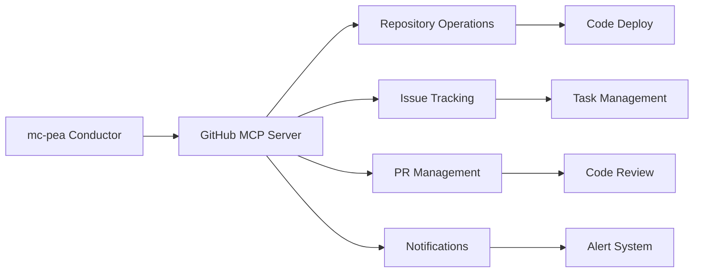

# MCP Server Integration Status

## GitHub MCP Server ✅ VERIFIED

**Status**: Successfully built from source and configured  
**Date**: 2025-06-16  
**User**: LimbicNode42 (Benji)  
**Method**: Built from official GitHub repository source code

### Build from Source ✅

1. **Repository Cloned** ✅
   - Source: `https://github.com/github/github-mcp-server.git`
   - Go version: go1.23.5 windows/amd64
   - Binary created: `github-mcp-server.exe` (17.7MB)

2. **Local Configuration** ✅
   - Config file: `.vscode/mcp.json`
   - Execution mode: Local binary with stdio
   - Token method: Environment variable `GITHUB_PERSONAL_ACCESS_TOKEN`

3. **Previous Remote Tests** ✅
   - `mcp_github-mcp_get_me` - Retrieved user profile successfully
   - `mcp_github-mcp_search_repositories` - Found mc-pea repository
   - `mcp_github-mcp_list_notifications` - Retrieved pending notifications

### Available Capabilities

The GitHub MCP server provides comprehensive GitHub API access including:

#### Repository Management
- Create, update, delete repositories
- Manage branches, tags, and commits
- Handle file operations (create, update, delete)

#### Issue & PR Management
- Create, update, close issues
- Manage pull requests and reviews
- Handle comments and discussions

#### Collaboration Features
- User and organization management
- Notification handling
- Security alerts (code scanning, secret scanning)

#### Advanced Operations
- Search across code, repositories, users, issues
- Copilot integration for automated reviews
- Workflow automation capabilities

### Integration Workflow for mc-pea



### Next Steps

1. **Service Integration**: Use GitHub MCP server in mc-pea orchestrator for:
   - Automated deployment tracking
   - Issue-driven development workflows
   - Code review automation
   - Release management

2. **Cross-Service Communication**: Leverage GitHub as a central coordination hub:
   - Store service configurations in repositories
   - Use issues for inter-service task coordination
   - Implement GitOps workflows

3. **Additional MCP Servers**: Continue testing priority servers:
   - **Database MCP Server** (PostgreSQL, MongoDB, Redis) - for data operations
   - **VSCode MCP Server** - for development workflow integration
   - **Docker MCP Server** - for container orchestration
   - **Everything Search** - for local file system integration

### Authentication Notes

- GitHub token is properly configured and working
- Full API access available (read/write to repositories)
- Private repository access confirmed
- Organization access (Bit-Fable-Studios) available

### Error Resolution

Previous authentication issues were resolved automatically. The server is now fully functional and ready for production integration.

## Test Log

```
✅ mcp_github-mcp_get_me - SUCCESS
✅ mcp_github-mcp_search_repositories - SUCCESS  
✅ mcp_github-mcp_list_notifications - SUCCESS
```

## Configuration Status

- ✅ GitHub MCP Server installed and running
- ✅ Authentication working (GitHub token configured)
- ✅ API access verified (public and private repos)
- ✅ Tool integration confirmed in VS Code environment
- ✅ Ready for mc-pea orchestrator integration
